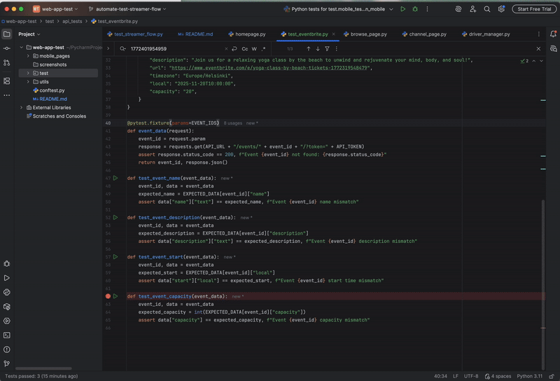

## About The Project

This repository contains tests for Twitch and Eventbrite.
The test written for Twitch covers streamer flow where structure can be extended to different scenarios and testing platform (web and more mobile options).
API tests are written to validate few events in created in Eventbrite.

## Setup

Prerequisites

1. Clone this repository: https://github.com/jcjsales/web-app-test.git
2. Install latest Python version
3. Configure a webdriver from Chrome
4. Install pytest
5. Install latest selenium

## How to run tests

In the terminal, 
```
pytest -s test/[test_folder]/[test_file].py
```
For example,
```
test/api_tests/test_eventbrite.py
```


## How to debug tests

1. In the IDE, go to the test file and mark breakpoints.
2. Click Debug


## Repository Structure

- `web-app-test/`
  - `assets/`   
  - `mobile_pages/`
  - `tests/`
    - `api_tests.py` – API test cases
    - `mobile_tests.py` - Mobile test cases
    - `web_tests.py` – Web test cases
  - `README.md` – Project documentation
  - `requirements.txt` – Test dependencies
  - `.gitignore` – Files to ignore in version control

## API Tests Coverage

| Test Cases                                                             | Steps                                                                                                                          | Automated Test Case Name | Assertion                                                                                                                                                      | Notes                                                                                                                                                         |
|------------------------------------------------------------------------|--------------------------------------------------------------------------------------------------------------------------------|-------------------------|-------------------------------------------------------------------------------------------------------------------------------------------------------------------------|---------------------------------------------------------------------------------------------------------------------------------------------------------------|
| As a user, I want to ensure that my event exists                       | 1. Send a GET request to the Eventbrite API using the event ID and token and return                                            | event_data              | assert response.status_code == 200                                                                             | Response code 200 means that the event is existing. If the retrieval of event fails, it could indicate that the event is not created successfully.            |
| As a user, I want to ensure that my event name is correct              | 1. Retrieve event data from API<br/>2. Compare name from the retrieved data with the expected name                             | test_event_name         | assert data["name"]["text"] == expected_name | "name" has keys "text" and "html". Getting the value of "text" will ensure the correct retrieval of data. Event name is the first crucial detail of an event. |
| As a user, I want to ensure that the event description is correct      | 1. Retrieve event data from API<br/>2. Compare the description from the retrieved data with the expected description           | test_event_description  | assert data["description"]["text"] == expected_description                                                                                  | Event description can change from time to time and ensuring that this information is updated is important for the success of the event.                       |
| As a user, I want to ensure that the event start date and time are correct | 1. Retrieve event data from API<br/>2. Compare the date and time from the retrieved data with the expected local date and time | test_event_start        | assert data["start"]["local"] == expected_start                                                                                                                         | If the start date has changed without the event-goers noticing it, it could lead to the failure of the event and unsatisfied event manager and event-goers.   |
| As a user, I want to ensure that the event capacity is correct         | 1. Retrieve event data from API<br/>2. Compare the capacity from the retrieved data with the expected value                    | test_event_capacity     | assert data["capacity"] == expected_capacity                                                                                                                            | This makes sure that the event will have the expected capacity to avoid unexpected number of event participants.                                              |


